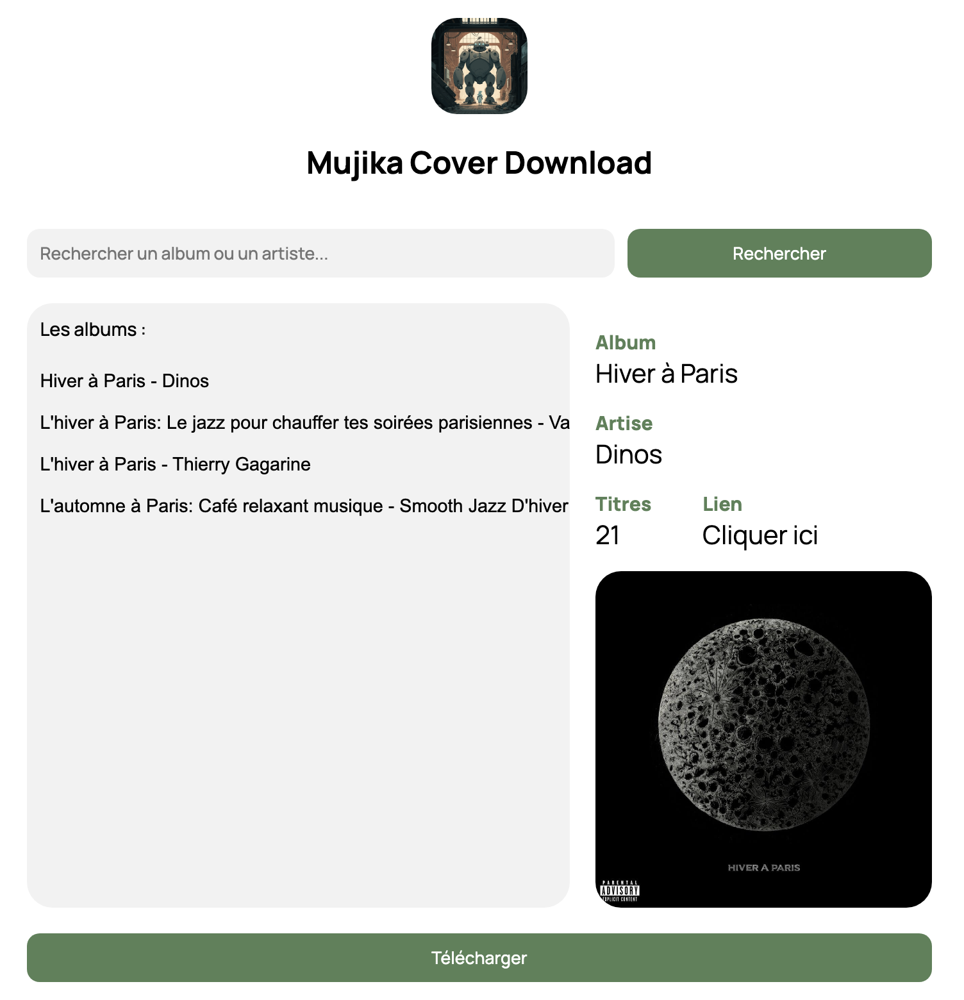

 

# Mujika

## Présentation

Mujika est un site web qui permet de télécharger n'importe quelle pochette d'album en très haute qualité de manière simple et rapide ! Ce site web parfaitement adapté pour la navigation mobile est l'évolution du [logiciel Mujika](https://github.com/444ldx/MujikaCoverDownloader) pour Windows.

Voici un exemple de l'interface de Mujika :

 

## Développement

Le site web est développé en langages web classiques et la partie logique en Javascrpit. 

Afin de récupérer les pochettes d'albums en 1000px*1000px, Mujika fait appel à [l'API officiel de Deezer](https://developers.deezer.com/api) et à son intégration en Javascript. De plus le site web est optimisé en SEO et en requêtes.
